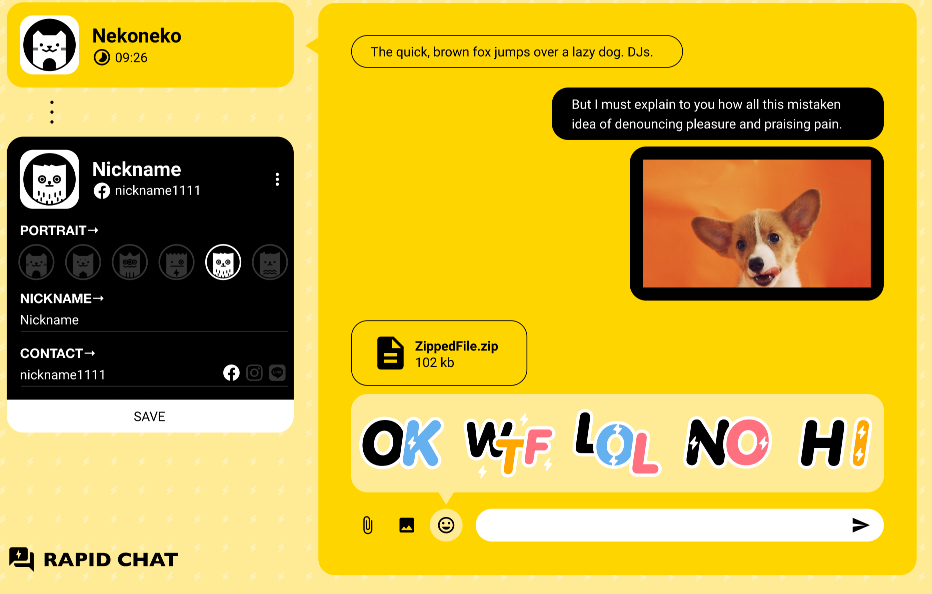

# 我是專案名稱

- http://bizdev.medialand.com.tw/milkmidi
- 主機：220.128.166.83
- remote：/bizdev.medialand.com.tw/milkmidi



## Team Member
- AM：
- 創意：
- 前端：
- 後端：

## Gulp 4
``` base
npm i -g gulp-cli
```

## Development Command line
``` bash
# serve with hot reload at localhost:3000
npm run start

# gulp imagemin and watch
gulp
```

## Production Command line
``` bash
# build for production with minification
npm run build

# gulp imagemin
gulp m
```

## Other Command line
``` bash
# generator vue template code
npm run plop

# stroybook
npm run storybook

# jest
npm run test

```